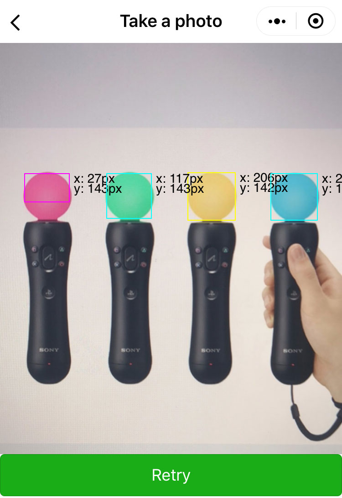

# Introduction of WeChat MiniProgram Web AR 

This is a WeChat Web AR Demo. On July 5, 2019, WeChat miniprogram supports AR. It has added a new API named "CameraFrameListener".

[CameraFrameListener API](https://developers.weixin.qq.com/miniprogram/dev/api/media/camera/CameraContext.onCameraFrame.html)

We can create AR effects with the new API. This demo demonstrates a color tracker effect by "tracking.js" library. 

The "tracking.js" library brings computer vision algorithms and techniques into browser environment. We can do real-time color tracking, face detection and much more.

[tracking.js](https://trackingjs.com/)

## Color Tracker

Use this Demo to scan the picture below.


Expect the effect below.

Use "Take a Photo" mode.



You also Use "Access a camera" mode.


## Face Tracker

Use this Demo to scan people's face.


Expect the effect below.

Use "Take a Photo" mode.


## How to improve performance
Face tracker is slow, but we can do some thing to improve speed. For example, we can blur image, grayscale image, sobel image, compress image and so on. After testing, we found that reducing image size is more proper. When image size is reduced, the parameters of tracker needs to be updated.

frame size of camera: the image size is smaller, the tracker's speed is faster.
```javascript
const frameWidth = 150;
```

face tracker parameter：the "initialScale" is bigger, the face tracker's speed is faster.
```javascript
const initialScale = 2;
```

color tracker parameter：the "minDimension" is bigger, the color tracker's speed is faster.
```javascript
const minDimension = 4;
```

time interval should be greater than cost time. The unit is milliseconds.
```javascript
const intervalTime = 350;
```
