1. [Chinese README](https://zhuanlan.zhihu.com/p/72617098)  

2. [Chinese Source Code Analysis](https://zhuanlan.zhihu.com/p/74438078)

## Updated 

| Date　　　| Update |
| -- | -- |
| 2021-09-07 | New: Added a Color Tracker mode. Please see the "Color AR". |
| 2021-08-15 | New: Added a video mask mode for image AR. This is a CSS 3D transformation, which does not require three.js. Please see the "Image AR and Video Mask". Update: Replace the spirit geometry with a plane geometry. |
| 2021-04-03 | Update: The "access a camera" mode of Image AR is recoverd. |
| 2021-03-15 | New: The display of the AR mask is changed from 2D to 3D by three.js. Update: Because the "access a camera" mode is slow, it is removed. |
| 2019-08-16 | Update: The project structure has been modified. The color tracker and object tracker are removed. Fix "access a camera" mode that does not work properly on Android. |
| 2019-08-06 | Fix Issue: When function "wx.canvasToTempFilePath" is called frequently on Android Wechat, WeChat will be crashed. |
| 2019-08-01 | Update: The perspective transform is achieved. |
| 2019-07-15 | Update: The NFT(Natural Feature Tracking) is achieved. |
| 2019-07-08 | New: The affine transform is achieved. |

## Introduction on WeChat Web AR 

This is a WeChat Web AR. On July 5, 2019, WeChat miniprogram supported AR. It was added a new API named "CameraFrameListener".

[CameraFrameListener API](https://developers.weixin.qq.com/miniprogram/dev/api/media/camera/CameraContext.onCameraFrame.html)

We can create AR effects with the new API. This demo demonstrates a AR tracker effect using "tracking.js" and "jsfeat" library. 

The "tracking.js" brings computer vision algorithms and techniques into browser environment. The "jsfeat" is also a JavaScript computer vision library.  We can do real-time image and face detection.

[tracking.js](https://trackingjs.com/) and [JSFeat](https://inspirit.github.io/jsfeat/)

Index Page of the WeChat Mini-program

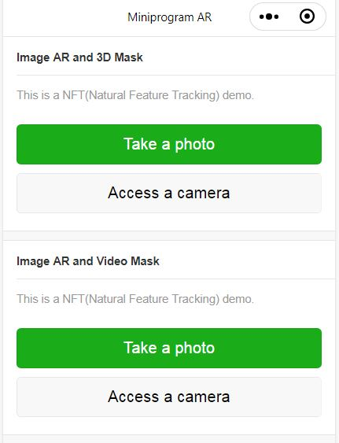
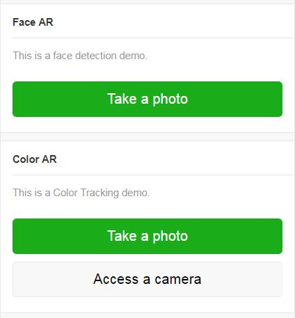

## Image AR and 3D Mask

Use the demo to scan a pattern image below. 


A cat beard is on the pattern image.

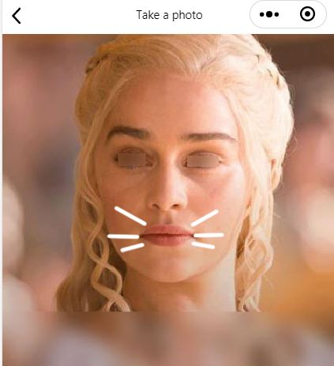

A effect of translating and scaling.

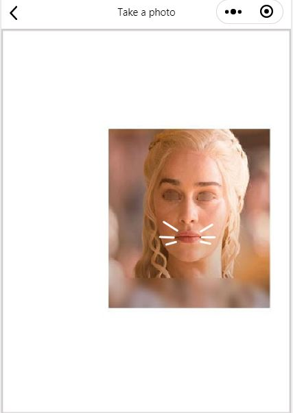

A effect of rotating.

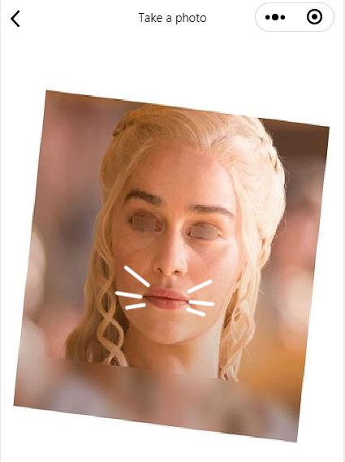

## Image AR and Video Mask

Use the demo to scan a rotating image below. 

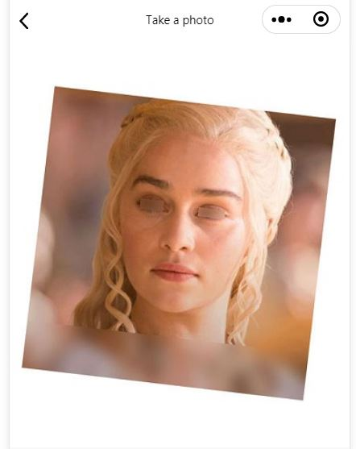

A video player is on and aligned with the image.

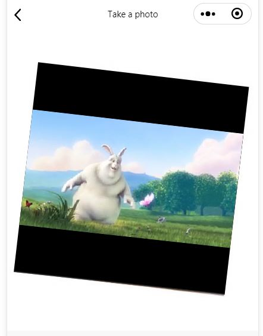

## Face AR

Use the demo to scan a face. Expect a effect below.

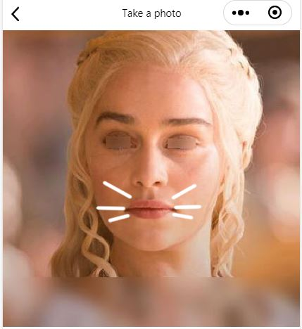

A effect of translating and scaling.

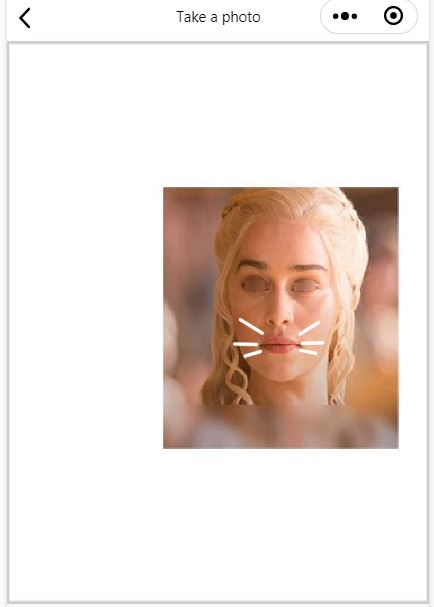

Because the landmarks of the demo are simple and basic, only a effect of translating and scaling is on a rotating image.

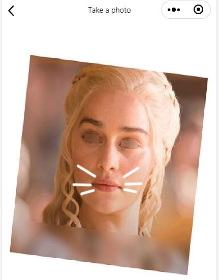

## Color AR

Use the demo to scan a yellow color. Expect a effect below.


A effect of hiddening.


Custom the color of the highlighted area.

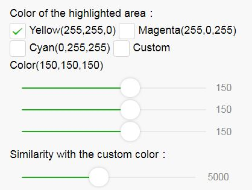

## How to replace the "cat beard" image

You may replace the default url of a image for 2D mask.

File: /package_image_tracker/pages/photo/photo.js and package_face_tracker/pages/photo/photo.js

```javascript
// a url of sprite image
const modelUrl = '../../utils/cat_beard.png';
```

The width and height of the "modelurl" image should be 256 x 256, 512 x 512 and 1024 x 1024 etc.

## How to replace the pattern image for Image AR

File: /package_face_tracker/utils/imageBusiness.js

```javascript
const patternImageUrl = '../../../face_pattern.jpg';
```

a pattern image


## How to put a image on other positions for Image AR

Select a track point on a pattern image, the point is used to set the "cat beard" image.

File: /package_image_tracker/utils/modelBusiness.js

```javascript
// a index of a track point on a pattern image
const trackPoint = { 
    x: 185, // the width of the pattern image is 375
    y: 224, // the height of the pattern image is 375
};
```

## How to put a image on other positions for Face AR

This is a map of the 31 keypoints of a face.

landmarks

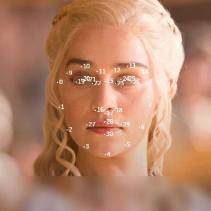

For example, a number 27 and number 29 are the sides of the mouth.

File: /package_face_tracker/utils/modelBusiness.js

```javascript
// index of the track points of the face
const trackPointA = {
    // index of a landmark
    id: 27,
    // X coordinate
    x: 155.69898111309, // the width of the face image is 375
};
const trackPointB = {
    // index of a landmark
    id: 29,
    // X coordinate
    x: 216.53075265284997, // the width of the face image is 375
};
```

## Known Issues

The AR demo is very slow on iOS WeChat.

