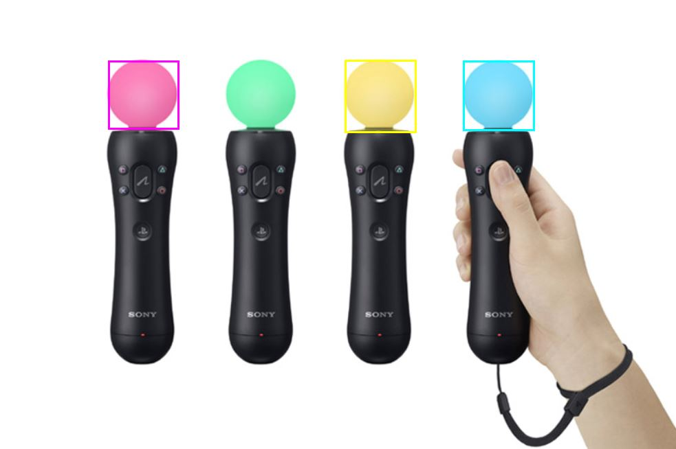

# Introduction of WeChat MiniProgram Web AR 

This is a WeChat Web AR Demo. On July 5, 2019, WeChat miniprogram supports AR. It has added a new API "CameraFrameListener".

[CameraFrameListener API](https://developers.weixin.qq.com/miniprogram/dev/api/media/camera/CameraFrameListener.html)

We can create AR effects with the new API. This demo demonstrates a color tracker effect by "tracking.js" library.

[tracking.js](https://trackingjs.com/)

Use this Demo to scan the picture below.

Expect the effect below.

Use "Take a Photo" mode.

Use "Access a camera" mode.

