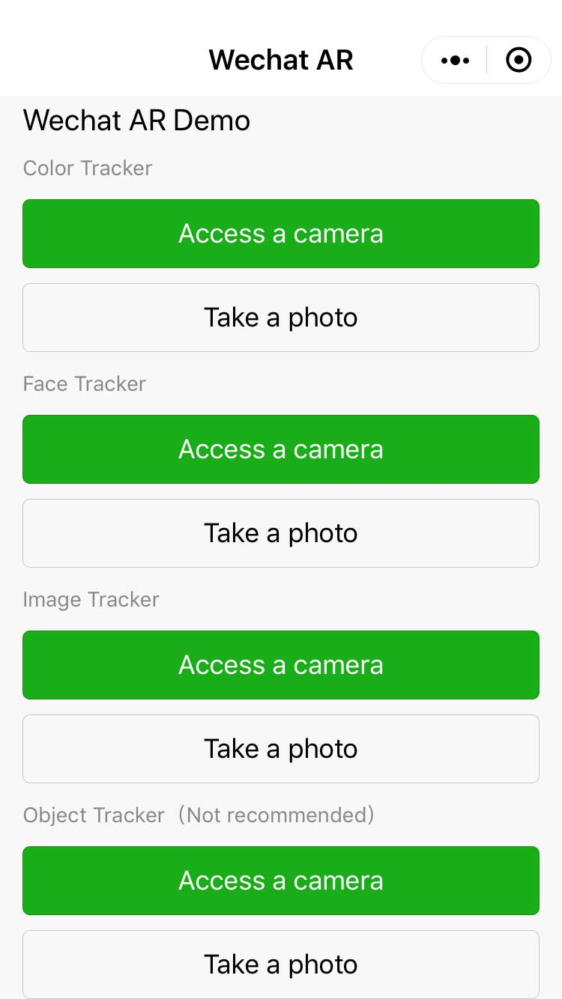
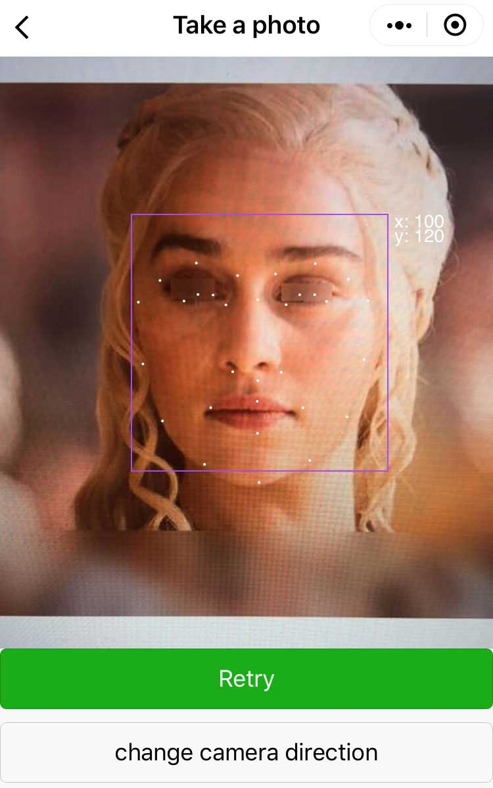
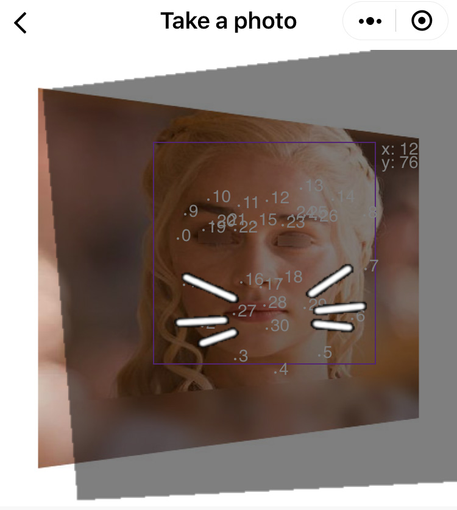
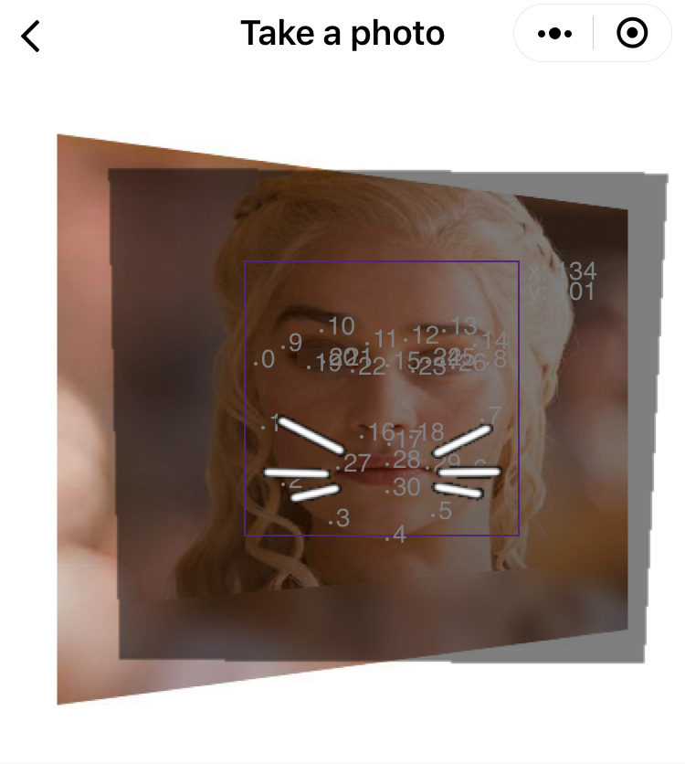
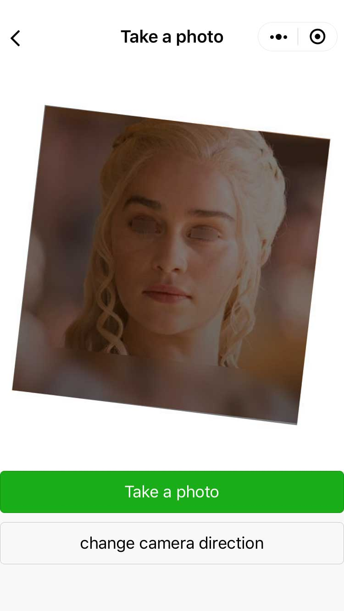
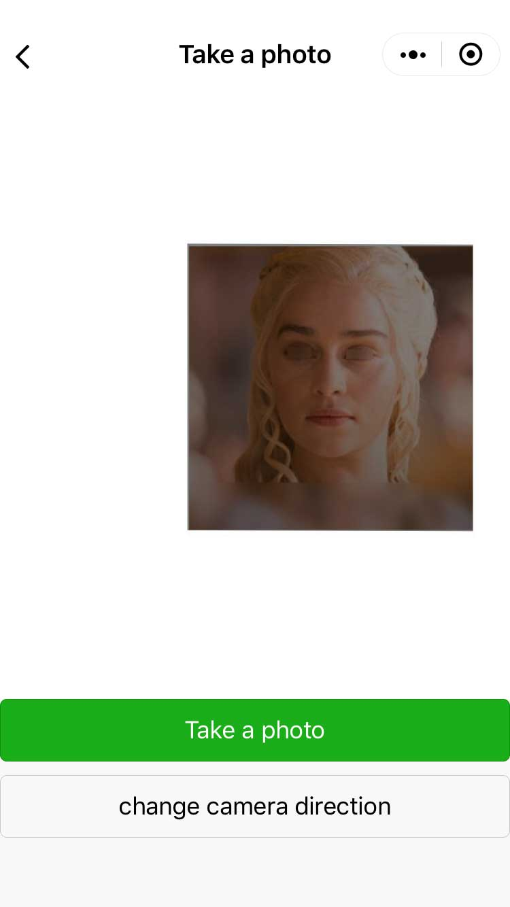
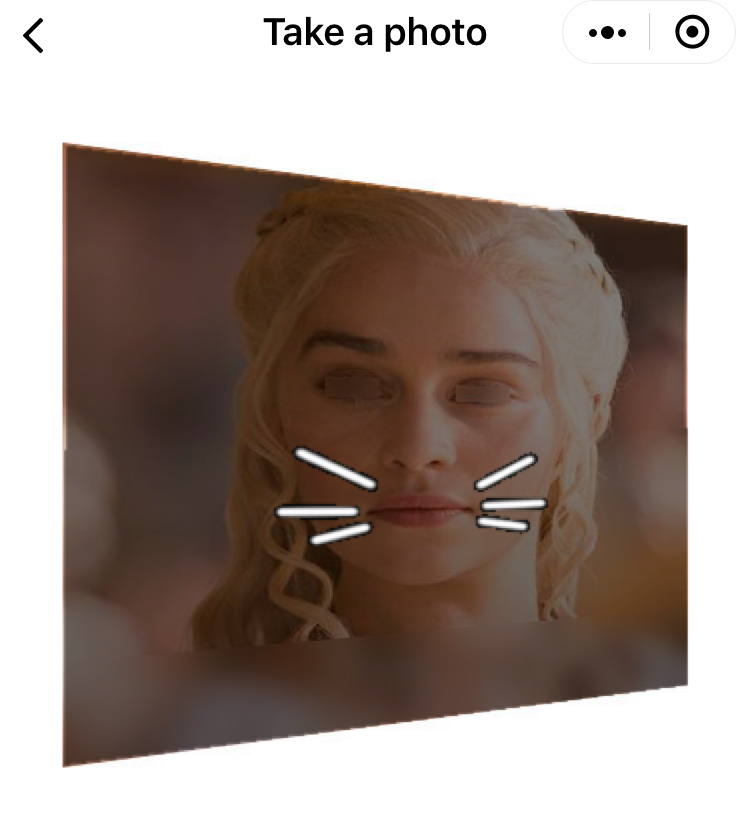
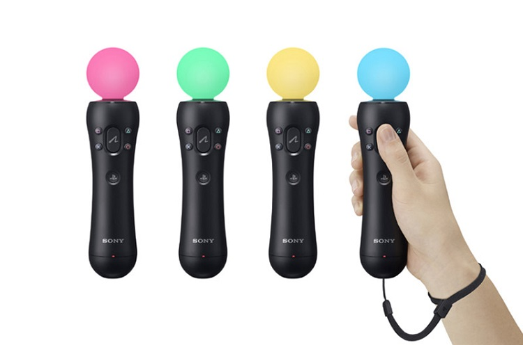
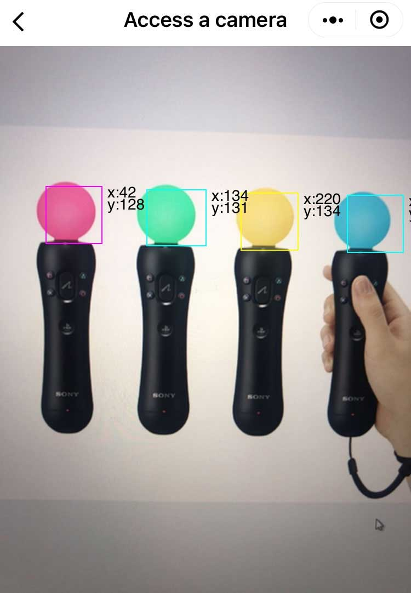

1. [Chinese README](https://zhuanlan.zhihu.com/p/72617098)  

2. [Chinese Source Code Analysis](https://zhuanlan.zhihu.com/p/74438078)

## Updated 

| Date　　　| Update |
| -- | -- |
| 2019-08-16 | Update: The project structure has been modified. The color tracker and object tracker are removed. Fix "access a camera" mode that is not work properly on Android. |
| 2019-08-06 | Fix Issue: When function "wx.canvasToTempFilePath" is called frequently on Android Wechat, WeChat will be crashed. |
| 2019-08-01 | Update: The perspective transform is achieved. |
| 2019-07-15 | Update: The NFT(Natural Feature Tracking) is achieved. |
| 2019-07-08 | New: The affine transform is achieved. |

## Introduction of WeChat MiniProgram Web AR 

This is a WeChat Web AR Demo. On July 5, 2019, WeChat miniprogram supports AR. It has been added a new API named "CameraFrameListener".

[CameraFrameListener API](https://developers.weixin.qq.com/miniprogram/dev/api/media/camera/CameraContext.onCameraFrame.html)

We can create AR effects with the new API. This demo demonstrates a color tracker effect using "tracking.js" and "jsfeat" library. 

The "tracking.js" brings computer vision algorithms and techniques into browser environment. We can do real-time color tracking, face detection and much more.

[tracking.js](https://trackingjs.com/)

The "jsfeat" is a JavaScript computer vision library. 

[JSFeat](https://inspirit.github.io/jsfeat/)

The Demo includes color tracker, face tracker, image tracker and object tracker. There are two modes for each item. It includes 'taking a photo' and 'access a camera'.



## Face Tracker

Use the Demo to scan people's face.


Expect the effect below.

Use "Take a Photo" mode.



When face recognition is not exact, the result is not good.



When face recognition is exact, the result is good.



## Image Tracker

a sample pattern picture is below.


Use the Demo to scan a rotate picture below.


Expected:



Use the Demo to scan a skew picture below.


Expected:


Use the Demo to scan a translate and scale picture below.


Expected:



Use the Demo to scan a perspective picture below.


Expected:



## Color Tracker (Removed)

Use the Demo to scan the picture below.



Expect the effect below.

Use "Take a Photo" mode.


Use "Access a camera" mode.



## Object Tracker (Removed)

There will be a rect aboves people's mouth. It is slow and not better than face tracker. 

## How to improve performance

Face tracker is slow, but we can do some thing to improve speed. For example, we can blur image, grayscale image, sobel image, compress image and so on. After testing, we found that reducing image size is more proper. When image size is reduced, the parameters of tracker needs to be updated.

frame size of camera: the image size is smaller, the tracker's speed is faster.
```javascript
const frameWidth = 150;
```

face tracker parameter：the "initialScale" is bigger, the face tracker's speed is faster.
```javascript
const initialScale = 2;
```

color tracker parameter：the "minDimension" is bigger, the color tracker's speed is faster.
```javascript
const minDimension = 4;
```

interval time: interval time should be greater than cost time. The unit is milliseconds.
```javascript
const intervalTime = 350;
```

## Known Issues
Image tracker and face tracker are very slow on iOS WeChat.
